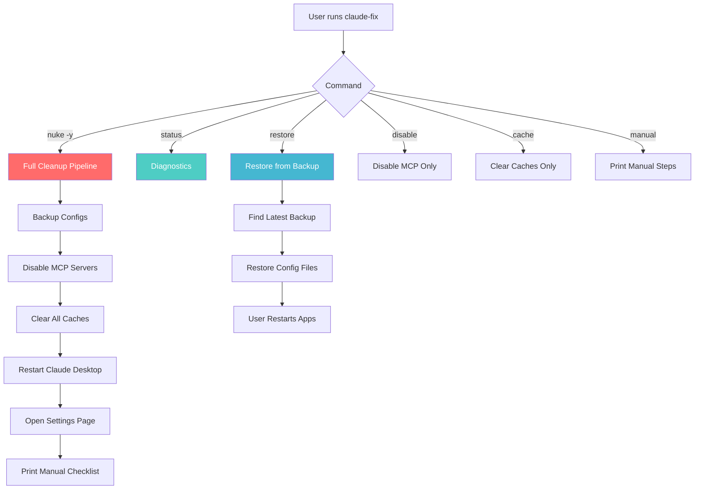
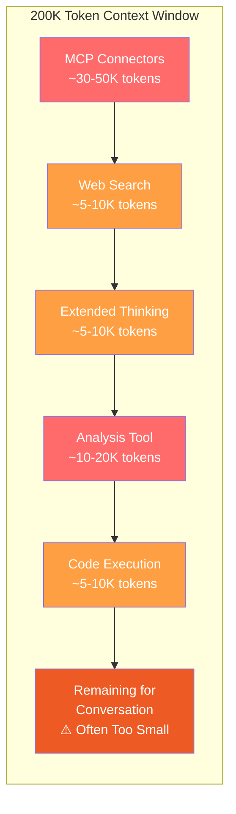
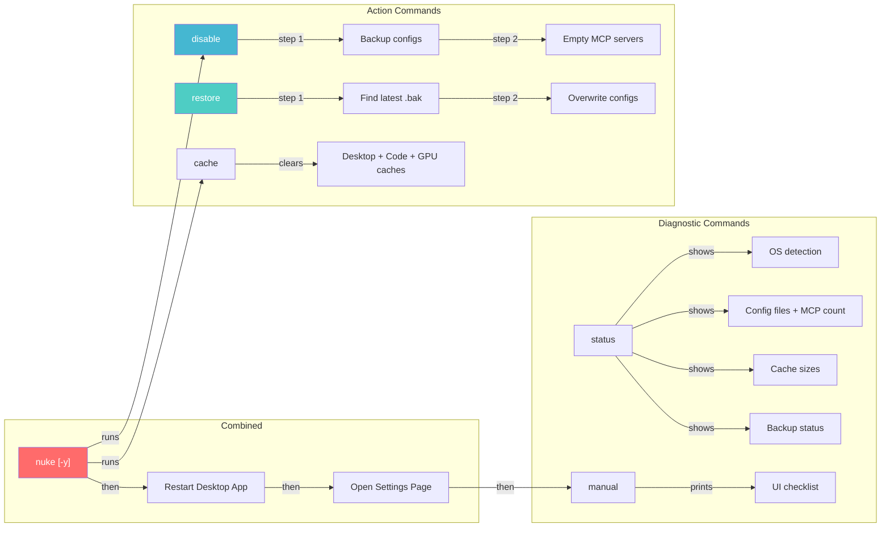
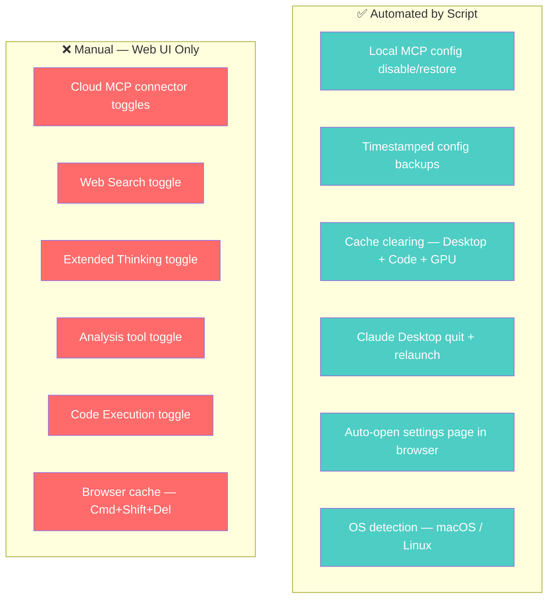
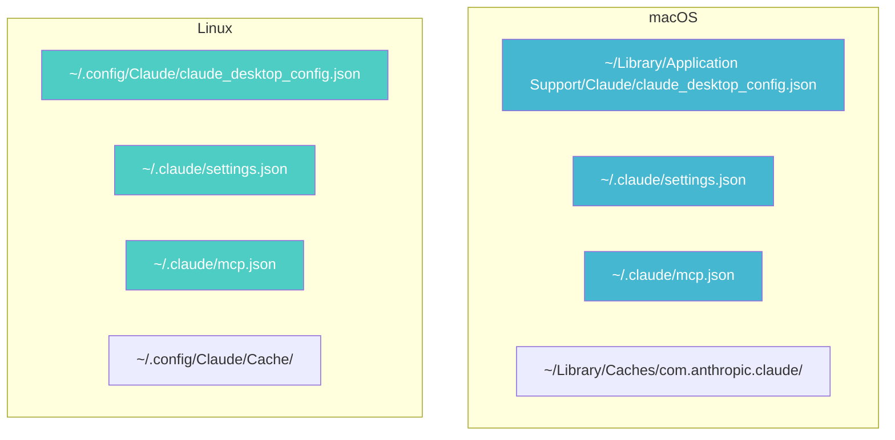
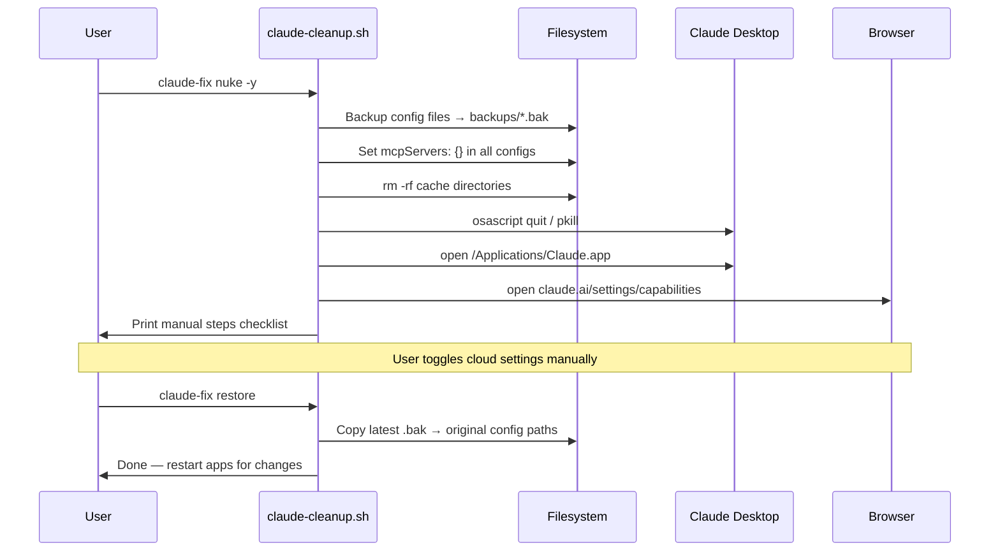
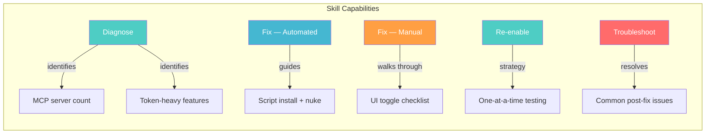
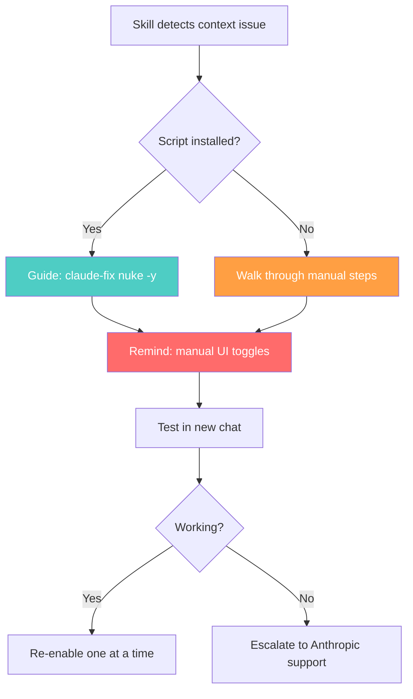

# Claude Context Window Cleanup Toolkit

> One-command fix when Claude's context window gets exhausted before conversations start.

## Architecture Overview



## Problem



When many tools and MCP connectors are enabled, they consume the context window **before any conversation begins**. This causes file creation failures, broken conversations, and degraded performance.

## Repository Structure

```
claude-cleanup/
├── claude-cleanup.sh        # Main cleanup script (bash, cross-platform)
├── SKILL.md                 # Claude Skill — teaches Claude to fix context issues
├── README.md                # This file
├── LICENSE                  # MIT License
├── .gitignore               # Excludes backups/ and .DS_Store
├── docs/
│   ├── ARCHITECTURE.md      # Technical deep-dive
│   └── TROUBLESHOOTING.md   # Common issues and fixes
└── backups/                 # Auto-created by script (gitignored)
    └── *.bak                # Timestamped config backups
```

## Quickstart

```bash
# Clone and install
git clone https://github.com/MulticloudMahoney/claude-cleanup.git ~/claude-cleanup
chmod +x ~/claude-cleanup/claude-cleanup.sh

# Add alias (zsh — default on macOS)
echo 'alias claude-fix="$HOME/claude-cleanup/claude-cleanup.sh"' >> ~/.zshrc && source ~/.zshrc

# Or bash
echo 'alias claude-fix="$HOME/claude-cleanup/claude-cleanup.sh"' >> ~/.bashrc && source ~/.bashrc
```

## Usage

### When Context Window Breaks

```bash
claude-fix nuke -y
```

Then toggle off cloud-side tools in the browser tab that auto-opens.

### Check Current State

```bash
claude-fix status
```

### Restore Everything

```bash
claude-fix restore
```

## Command Reference



| Command | Description | Destructive | Auto-backup |
|---------|-------------|:-----------:|:-----------:|
| `status` | Show config state, MCP count, cache sizes | No | — |
| `disable` | Backup configs → disable all MCP servers | Yes | ✅ |
| `restore` | Restore configs from latest backup | Yes | — |
| `cache` | Clear all Claude-related caches | Yes | — |
| `nuke [-y]` | Full reset: disable + cache + restart + open settings | Yes | ✅ |
| `manual` | Print manual UI steps checklist | No | — |

| Flag | Description |
|------|-------------|
| `-y` / `--yes` | Skip confirmation prompts (for `nuke`) |

## Automation vs Manual Scope



## Config File Locations



## Data Flow



## Claude Skill

This repo includes a Claude Skill (`SKILL.md`) that teaches any Claude instance how to diagnose and fix context window exhaustion — no script install required.

### What the Skill Does



### Install as Custom Skill

**Option A — Claude Projects (claude.ai):**
1. Create a new Project (or open an existing one)
2. Add `SKILL.md` to Project Knowledge
3. Any conversation in that project now knows how to fix context issues

**Option B — Claude Code / Claude Desktop (local skill):**
```bash
# Create the skill directory
mkdir -p ~/.claude/skills/claude-context-cleanup

# Copy the skill file
cp ~/claude-cleanup/SKILL.md ~/.claude/skills/claude-context-cleanup/SKILL.md
```

**Option C — Share the `.skill` package:**

Download `claude-context-cleanup.skill` from [Releases](https://github.com/MahoneyContextProtocol/claude-cleanup/releases) and import it into any Claude instance that supports custom skills.

### Skill + Script Together

The skill knows about the script. If the script is installed, the skill guides users to run `claude-fix` commands. If not, it walks through manual diagnosis and fix steps. Either way works.



## Background

Built after experiencing persistent context window exhaustion with a large number of MCP connectors enabled. The Anthropic support team confirmed that enabled tools and features consume context window tokens before any conversation begins. This script streamlines the diagnostic and cleanup process.

Particularly useful for power users running many MCP integrations across Claude Desktop, Claude Code, and claude.ai simultaneously.

## Contributing

Issues and PRs welcome. The script is intentionally a single bash file with no dependencies beyond Python 3 (used for JSON parsing).

## License

[MIT](LICENSE)
