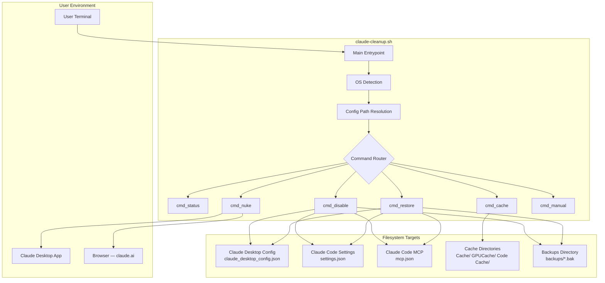
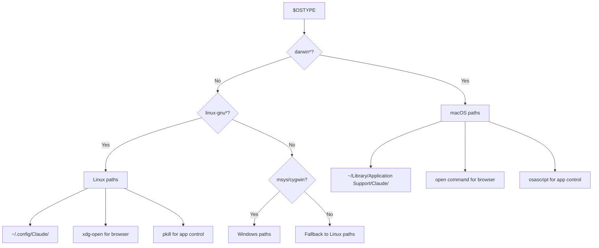
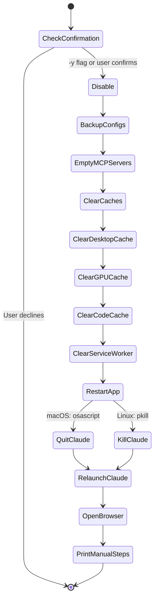

# Architecture

## System Context



## OS Detection Logic



## Config File Schema

The script handles two JSON key formats for MCP servers:

```json
// Format 1: Claude Desktop
{
  "mcpServers": {
    "server-name": {
      "command": "...",
      "args": ["..."]
    }
  }
}

// Format 2: Claude Code
{
  "mcp_servers": {
    "server-name": {
      "url": "..."
    }
  }
}
```

The `disable` command sets both keys to `{}`. The `restore` command overwrites the entire file from backup.

## Backup Strategy


Backups are timestamped to the second. The `restore` command always picks the most recent backup per config file using `ls -t | head -1`.

## Nuke Pipeline



## Dependencies

| Dependency | Purpose | Required |
|-----------|---------|:--------:|
| bash | Script runtime | ✅ |
| python3 | JSON parsing | ✅ |
| osascript | macOS app control | macOS only |
| pkill/pgrep | Process management | ✅ |
| open/xdg-open | Browser launch | Optional |
| du | Cache size reporting | ✅ |

## Security Considerations

The script operates only on local config files and caches. It never transmits data, accesses credentials, or modifies anything outside of Claude's config directories and the backup folder. Config backups may contain MCP server URLs and authentication tokens — the `backups/` directory is gitignored by default.
