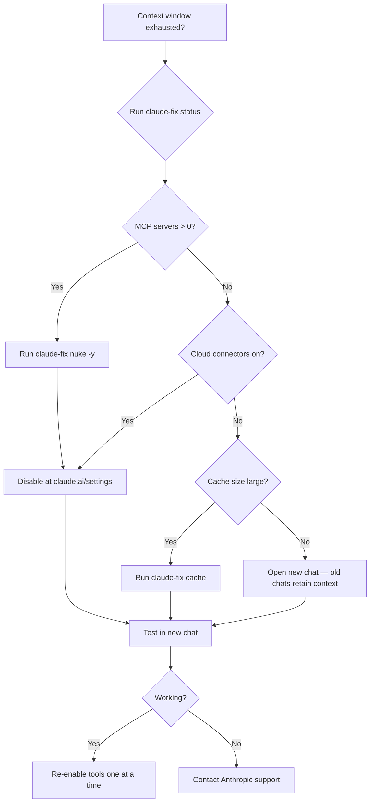

# Troubleshooting

## Common Issues

### `claude-fix: command not found`

The alias isn't loaded. Either:
- Open a **new terminal tab** (aliases load on shell startup)
- Or run: `source ~/.zshrc` (macOS) / `source ~/.bashrc` (Linux)

If still not working, check the alias was added:
```bash
grep claude-fix ~/.zshrc  # or ~/.bashrc
```

If missing, add it manually:
```bash
echo 'alias claude-fix="$HOME/claude-cleanup/claude-cleanup.sh"' >> ~/.zshrc
```

### `python3: command not found`

The script uses Python 3 for JSON parsing. Install it:
- **macOS:** `xcode-select --install` (includes Python 3) or `brew install python3`
- **Linux:** `sudo apt install python3` or `sudo dnf install python3`

### `No config files found to process`

Your Claude configs aren't in the expected locations. Run `claude-fix status` to see which paths are checked. If your configs are elsewhere:
1. Find them: `find ~ -name "claude_desktop_config.json" 2>/dev/null`
2. The script checks these paths by OS — see [Architecture](ARCHITECTURE.md) for details

### `permission denied` on claude-cleanup.sh

```bash
chmod +x ~/claude-cleanup/claude-cleanup.sh
```

### Nuke ran but context window is still broken

The script only handles **local** MCP configs and caches. You still need to manually:

1. Go to `claude.ai/settings/capabilities`
2. Toggle OFF all cloud MCP connectors
3. Toggle OFF Web Search, Extended Thinking, Analysis
4. Clear browser cache (Cmd+Shift+Del / Ctrl+Shift+Del)
5. Start a **new chat** (existing chats retain old context)

### Restore didn't bring back all my MCP servers

Check which configs were backed up:
```bash
ls -la ~/claude-cleanup/backups/
```

The restore command picks the **most recent** backup per file. If you ran `disable` multiple times, earlier backups may have more servers. To restore a specific backup:
```bash
cp ~/claude-cleanup/backups/claude_desktop_config.json.YYYYMMDD_HHMMSS.bak \
   ~/Library/Application\ Support/Claude/claude_desktop_config.json
```

### Claude Desktop didn't restart

On macOS, the script tries `osascript` first, then falls back to `pkill`. If neither works:
- Quit Claude Desktop manually (Cmd+Q)
- Reopen from Applications

On Linux:
- `pkill -f claude-desktop`
- Relaunch from your app menu

## Diagnostic Checklist



## Getting Help

If this tool doesn't resolve your issue, contact [Anthropic support](https://support.anthropic.com) with:
- Output of `claude-fix status`
- Number of cloud MCP connectors you had enabled
- Which tools were active (Web Search, Extended Thinking, etc.)
